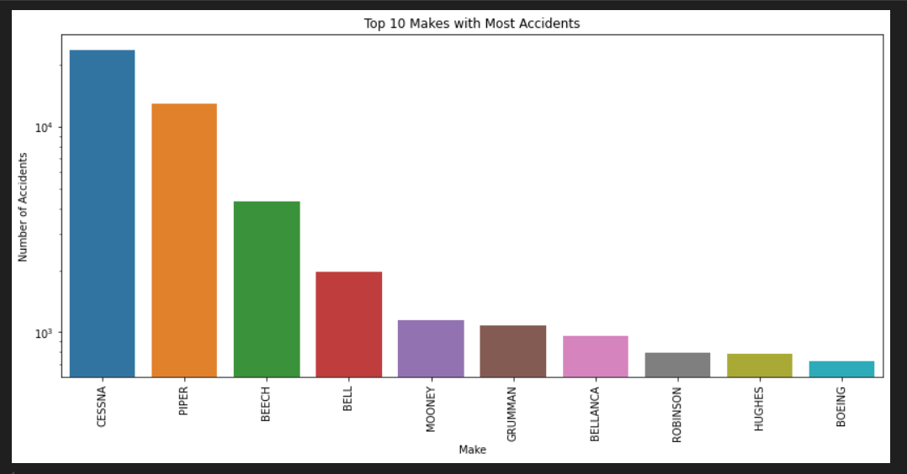

# DATA_AVIATION_PROJECT

## Overview

This project explores aviation accident data to provide insights into which aircraft makes and models are safer based on historical accident data. By analyzing this data, I aim to guide customers in making informed decisions about aircraft purchases and usage.

## Business Understanding

From a business perspective, the primary goal is to advise customers on the safest aircraft makes and models based on past accident data. This analysis can help airlines, private owners, and other stakeholders in the aviation industry choose aircraft that are associated with fewer accidents, potentially reducing risk and improving safety.

## Data Understanding

The dataset includes several important columns:

1. Make: Manufacturer of the aircraft.
2. Model: Specific model of the aircraft.
3. Aircraft.Category: Type of aircraft (e.g., Airplane, Helicopter).
4. Event.Date: Date of the accident.
5. Broad.phase.of.flight: Phase of flight during the accident.
6. Aircraft.damage: Extent of damage to the aircraft

## Data Analysis

### Data Cleaning and Preprocessing

#### Handling Missing Values:

1. Filled missing Broad.phase.of.flight values based on similar accidents or marked as 'Unknown'.
2. Used Make column to fill missing Aircraft.Category values (e.g., 'Cessna' = 'Airplane').
3. Dropping columns that i did not use for visualization.

### Visualizations

#### Accident Frequency Over Time

X-axis: Event.Date
Y-axis: Count of Accidents
Purpose: Show trends over time.
Type: Line chart

#### Accidents by Aircraft Make

X-axis: Make
Y-axis: Count of Accidents
Purpose: Show which makes have the most accidents.
Type: Bar chart.

#### Accidents by Aircraft Category

X-axis: Aircraft.Category
Y-axis: Count of Accidents
Purpose: Show accidents by category.
Type: Bar chart

### Tableau Dashboard

1. Creating Combined Filters

2. Create a Parameter

- Name: Select Filter
- Type: String
- Values: 'Purpose.of.flight', 'Event.Date', 'Top.10.Makes', 'Broad.phase.of.flight', 'Aircraft.Category', 'Aircraft.damage'

3. Create a Calculated Field

CASE [Select Filter]
WHEN 'Purpose.of.flight' THEN STR([Purpose.of.flight])
WHEN 'Event.Date' THEN STR([Event.Date])
WHEN 'Top.10.Makes' THEN STR([Top.10.Makes])
WHEN 'Broad.phase.of.flight' THEN STR([Broad.phase.of.flight])
WHEN 'Aircraft.Category' THEN STR([Aircraft.Category])
WHEN 'Aircraft.damage' THEN STR([Aircraft.damage])
ELSE 'Unknown'
END

4. Add to Filters: Drag this field to the Filters shelf in your visualizations.

5. Show Parameter Control: Right-click the Select Filter parameter and choose "Show Parameter Control"

## Recommendations

Based on the analysis, I recommend the following:

Choose Safe Aircraft Makes: Prefer makes with fewer accidents for better safety.
Enhance Safety Protocols: Focus on improving safety during flight phases with more accidents.
Work with Manufacturers: Collaborate with manufacturers with higher accident rates to identify and mitigate risks

## Next Steps

Further Analysis: Investigate other factors like weather and pilot experience.
Predictive Models: Develop models to predict and prevent future accidents.

## Thank You

This concludes the analysis. For questions or further discussion, please contact:

Name: Kellie Njoki Ndaru
Github: [https://github.com/kellie-menyl/DATA_AVIATION_PROJECT]
Tableau public: [://public.tableau.com/app/profile/kellie.njohttpski/viz/Aviation_data_new/AviationStory]
Email: [kelliemenyl@gmail.com]